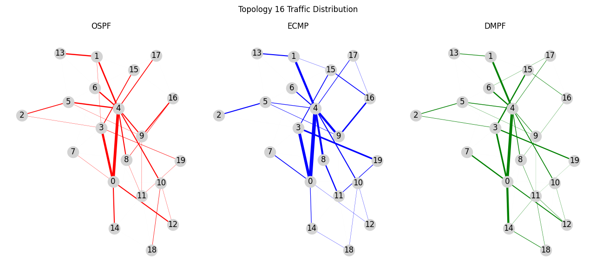

This repository contains implementations of three routing protocols and their evaluation on various network performance metrics:

- **OSPF (Open Shortest Path First)**: Traditional shortest path protocol using Dijkstra's algorithm.
- **ECMP (Equal-Cost Multi-Path Routing)**: Uses multiple equal-cost paths to balance traffic.
- **DMPF (Disjoint Multi-Path Forwarding)**: Uses edge-disjoint paths within a bounded cost for multipath routing.

The simulation is designed to work with a custom network topology defined in JSON format, and includes tools for evaluating link utilization, fairness, and other metrics.


## Features

- Custom network topology input in JSON format
- Path computation and logging for each protocol
- Evaluation metrics including:
  - Link utilization
  - Fairness
  - Path diversity
- Optional topology visualization

## Project Structure

```
.
├── main.py                  # Entry point for running the routing simulations
├── analysis.py              # Gives comparative numerical analysis for Simulation
├── topology.json            # Network topology in JSON format
├── protocols/
│   ├── ospf.py              # OSPF protocol implementation
│   ├── ecmp.py              # ECMP protocol implementation
│   └── dmpf.py              # DMPF protocol implementation
├── utils/
│   ├── topology_loader.py   # Helper module for loading and parsing topology JSON
│   └── visualize.py         # (Optional) Topology visualization
├── evaluate.py              # Script to evaluate and compare routing protocol performance
├── paths/
│   ├── ospf_paths.csv       # Computed paths using OSPF
│   ├── ecmp_paths.csv       # Computed paths using ECMP
│   └── dmpf_paths.csv       # Computed paths using DMPF
```

## How to Run

Run the simulator by specifying the protocol you want to test:

```bash
python main.py --protocol OSPF
python main.py --protocol ECMP
python main.py --protocol DMPF
```

By default, the simulation uses `topology.json` in the root directory. To use a different topology file, pass the `--topology` argument:

```bash
python main.py --protocol DMPF --topology custom_topology.json
```

## Simulation Results (Comparative Numerical Analysis)

| Metric                     | OSPF     | ECMP     | DMPF     | BEST                         |
|----------------------------|----------|----------|----------|----------------------------- |
| Normalized Traffic Load    | 141.1183 | 141.0104 | 127.4570 | **DMPF** (lower better)      |
| Bandwidth Utilization ratio| 3.6574   | 3.6561   | 3.3001   | **DMPF** (lower better)      |
| Failure Impact             | 0.1051   | 0.1039   | 0.1039   | **ECMP/DMPF** (lower better) |
| Bottleneck Freq            | 0.0414   | 0.0416   | 0.0456   | **OSPF/ECMP/DMPF** (lower better) |
| Max Utilization            | 298.4700 | 297.7900 | 291.981  | **DMPF** (lower better)      |
| Min Utilization            | 100.0000 | 100.0000 | 68.3223  | **OSPF/ECMP** (higher better)|
| Entropy                    | 4.1582   | 4.1608   | 4.2808   | **DMPF** (higher better)     |
| Packet Loss                | 105.0600 | 103.9000 | 103.8653 | **DMPF** (lower better)      |

## Traffic Distribution 


